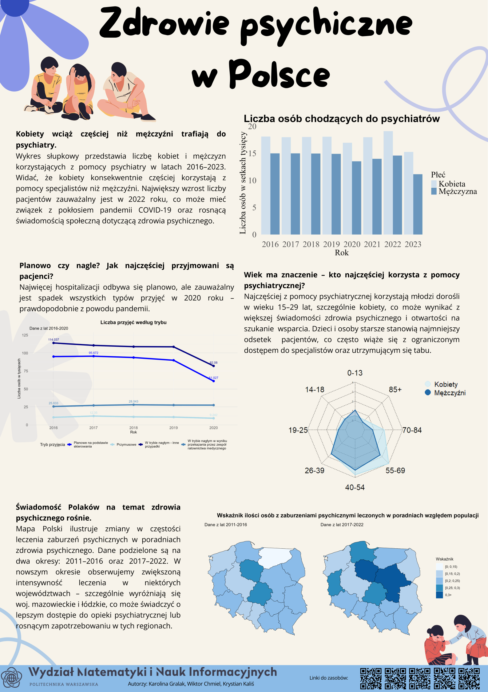

# Mental Health in Poland – Data Visualization

## Overview
This project features a comprehensive data visualization poster that explores the evolving landscape of mental health awareness in Poland and the growing trend of individuals seeking professional psychiatric care.

## Key Insights & Focus Areas
* **Geographical Distribution:** To illustrate the scale of the issue, we mapped the demand across Poland, highlighting the Mazowieckie and Łódzkie voivodeships, which currently exhibit the highest need for psychiatric care.
* **Demographic Trends:** Leveraging available data, our analysis reveals that young adults (aged 15–29)—particularly women—constitute the primary demographic actively seeking psychiatric support.
* **Gender Disparities:** The visualization emphasizes the persistent gender gap in the utilization of mental health services.
* **Hospitalization Trajectories:** We also outline the trends in planned psychiatric hospital admissions over recent years to provide a broader context of the healthcare system's load.

## Authors
Krystian Kaliś, Karolina Gralak, Wiktor Chmiel

## Data Sources
- https://dane.gov.pl/pl/dataset/3523
- https://dane.gov.pl/pl/dataset/3055/resource/45650,informacje-o-liczbie-przyjec-na-stacjonarne-oddziay-psychiatryczne-i-oddziay-leczenia-uzaleznien/table
- https://bdl.stat.gov.pl/bdl/dane/podgrup/tablica
- https://stat.gov.pl/obszary-tematyczne/ludnosc/ludnosc/powierzchnia-i-ludnosc-w-przekroju-terytorialnym-w-2022-roku,7,19.html
- https://stat.gov.pl/obszary-tematyczne/ludnosc/ludnosc/ludnosc-i-ruch-naturalny-w-2016-r-,30,1.html

---

